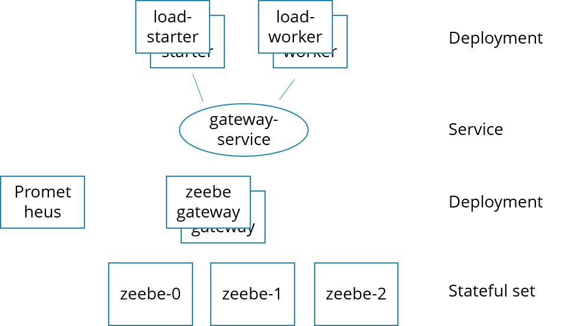

# zeebe-loadtest-kubernetes
Load tests for Zeebe which can be run on Kubernetes using Helm charts to provision everything automatically.



## Running this on Google Cloud

You should be able to run in on every Kubernetes environment, I currently run it on Google Cloud by:

* Create the cluster:
```
gcloud container clusters create zeebe-load --num-nodes 8 --machine-type=n1-standard-2
```

Other machine types: n1-highmem-2, n1-standard-2, n1-highcpu-2

* Make sure you are in the directory of the config maps:

```
cd k8s-config-map
```

* Create ElasticSearch for Exporter

```
kubectl apply -f elastic-storage.yaml
kubectl apply -f elastic-service-cluster.yaml
kubectl apply -f elastic-service-gateway.yaml
kubectl apply -f elastic-service-loadbalancer.yaml
kubectl apply -f elastic.yaml
```


* Create Zeebe cluster (services go first!). The config adds the exporter to Elastic, so make sure it is created first.

```
kubectl apply -f zeebe-service-cluster.yaml
kubectl apply -f zeebe-service-gateway.yaml
kubectl apply -f zeebe-config.yaml
kubectl apply -f zeebe.yaml
```

* Create load / workers (do not start before Zeebe is up)

```
kubectl apply -f load-starter.yaml
kubectl apply -f load-worker.yaml
```

* Start Operate

```
kubectl apply -f operate-config.yaml
kubectl apply -f operate-service-loadbalancer.yaml
kubectl apply -f operate.yaml
```


* Delete cluster once you are finished

```
gcloud container clusters delete zeebe-load
```

## Some commands that might be helpful

* Bash into Zeebe pod:

```
kubectl exec -it zeebe-0 -- /bin/bash
```

* Show Zeebe cluster topolgy (on Zeeeb pod):
```
ZB_BROKER_ADDR=zeebe-0.zeebe:26500 /usr/local/zeebe/bin/zbctl status
```

* Show log of Zeebe
```
tail -f /usr/local/zeebe/logs/zeebe.log
```

* Copy Zeebe log to your machine
```
kubectl cp zeebe-0:/usr/local/zeebe/logs/zeebe.log logs
```
